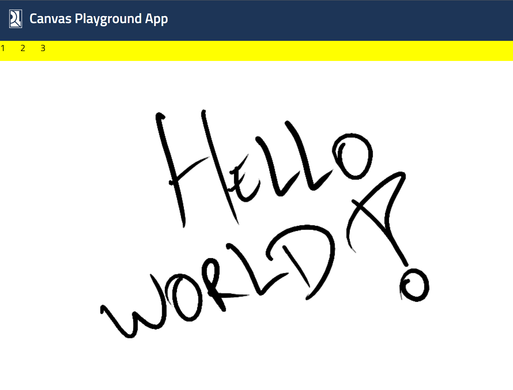

# Canvas Playground

A showcase application demonstrating advanced programming techniques with HTML Canvas.

## Project Overview

This application is a work in progress, designed to explore and demonstrate various capabilities of HTML Canvas. It serves as a playground for experimenting with drawing tools, real-time rendering, and interactive graphics.

## Features

- Interactive drawing tools
- Real-time stroke rendering
- Pressure sensitivity support (for compatible devices)
- Eraser functionality
- Responsive canvas sizing

## Preview


_Note: This is a temporary preview and may not reflect the current state of the application._

## Getting Started

### Prerequisites

- Node.js (LTS version recommended)
- pnpm package manager

### Installation

1. Clone the repository:

   ```
   git clone https://github.com/your-username/canvas-playground.git
   cd canvas-playground
   ```

2. Install dependencies:
   ```
   pnpm install
   ```

### Running the Project

To start the development server:

```
pnpm dev
```

This will start the application on `http://localhost:5173`.
